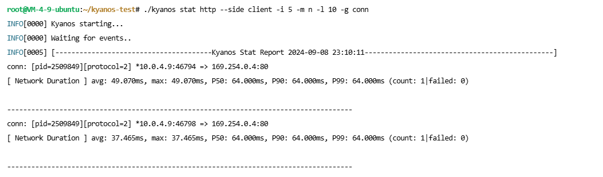
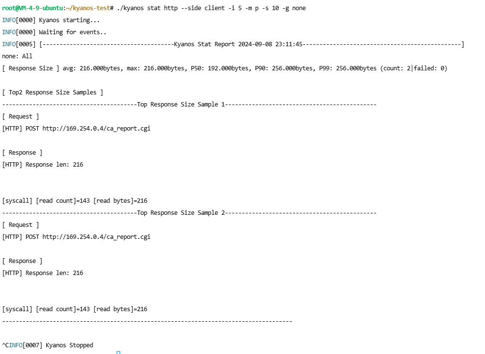
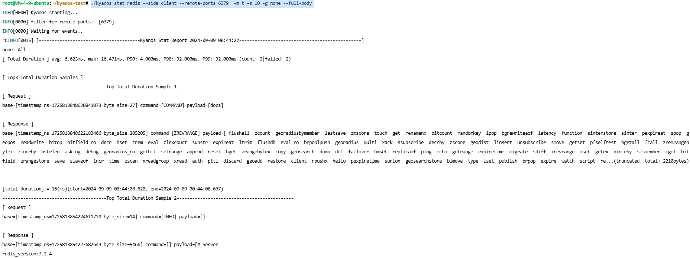
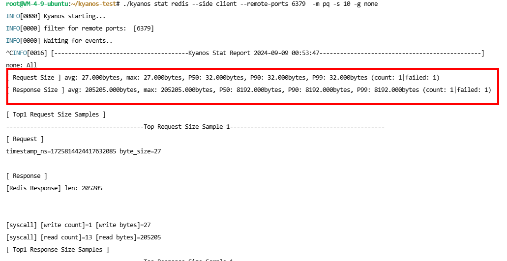

# kyanos
  [](#) [](#) [](#-license)

⭐ 觉得kyanos还不错？点个star吧~

[](https://x.com/intent/tweet?text=Check%20out%20this%20project%20on%20GitHub:%20https://github.com/hengyoush/kyanos%20%23OpenIDConnect%20%23Security%20%23Authentication)
[](https://www.facebook.com/sharer/sharer.php?u=https://github.com/hengyoush/kyanos)
[](https://www.linkedin.com/sharing/share-offsite/?url=https://github.com/hengyoush/kyanos)
[](https://www.reddit.com/submit?title=Check%20out%20this%20project%20on%20GitHub:%20https://github.com/hengyoush/kyanos)
[](https://t.me/share/url?url=https://github.com/hengyoush/kyanos&text=Check%20out%20this%20project%20on%20GitHub)

## Table of Contents
- [Motivation](#-motivation)
- [What is kyanos](#-what-is-kyanos)
- [Requirements](#-requirements)
- [How to get kyanos](#-how-to-get-kyanos)
- [Usage](#-usage)
- [Feedback and Contributions](#-feedback-and-contributions)
- [Contacts](#%EF%B8%8F-contacts)

## 🚀 Motivation

>  你有没有遇到过这样的问题：  
你负责一个业务服务，突然有一天客户端气势汹汹地找你😡，问你的接口为什么调用超时?  
你慌了😩但强作镇定查看监控，发现自己服务的接口*耗时正常*  
在你刚想回怼他之前你突然想到公司的监控 **仅能监控到服务端应用的耗时, 可中间内核和网络的耗时没有监控**！ 于是你们谁也说服不了谁👿, 接下来开始互相扯皮甩锅，最后问题不了了之

> 反过来，你调用下游接口超时，但对方监控显示并没有超时，于是又开始新的扯皮流程，不同的是你站在了另一边...

🤓👍然而当你使用了kyanos:


如果你需要打印请求响应体，你可以这样：


## 🎓 What is kyanos

kyanos正是为了快速排查这类问题诞生的，它是一个**面向程序员**的网络问题分析工具，它有如下优势💪：
- 😏 使用简单, 人性化: 和其他网络分析工具不同，它站在请求响应的视角而不是单个数据报文, 不需要人肉分辨你抓的包哪些是请求哪些是响应,  `kyanos` 会自动匹配好.
- 🏎 超级灵活: `kyanos` 以每个请求响应为基础, 统计每次请求响应的耗时, 报文大小, 并且根据需要可以聚合到更高的维度, 使用起来很灵活, 你可以很方便的用一行命令实现诸如: 统计所有 `HTTP` 请求响应最慢的Top5记录, 并且打印请求响应报文!
- 🔎 深入内核采集, 不再有盲区: `kyanos` 基于 `eBPF` 技术, 可以采集到每个请求响应的数据包在内核协议栈中的详细耗时. 最有帮助的耗时如: 1. 请求/响应到达网卡的耗时 2. 数据从socket缓冲区读取的耗时 `kyanos` 都帮你采集好了。
- 自动解析L7协议报文🕹: `kyanos` 目前支持 `HTTP` , `Redis` 和 `MySQL` 这三种业务开开发最常用到的协议报文解析, 后续会支持更多协议.

## ❗ Requirements

Kyanos当前支持5.4及其以上版本内核，更低版本内核未经过测试。
> 通过`uname -r`查看内核版本


## 🎯 How to get kyanos 
执行如下脚本获取kyanos可执行文件
```bash
wget -O kyanos.zip https://github.com/hengyoush/kyanos/releases/download/v1.0.0/kyanos.zip
unzip kyanos.zip
chmod a+x kyanos
sudo kyanos
```

## 📝 Usage

kyanos目前有两个主要功能：

1.  watch: 用于观察每个请求响应的：请求响应体 + 耗时情况（包含总耗时，网络耗时，从Socket缓冲区读取耗时等） + 请求响应大小
2.  stat：区别于watch的细粒度，stat可以自定义聚合条件，观察更高维度的信息，比如：一个连接上的耗时情况（包括平均耗时，P99线等），请求大小等。

### 🔍 Watch

用法：

```bash
./kyanos watch --help
It is possible to filter network requests based on specific protocol and print the request/response data to the console.

Usage:
  kyanos watch [http|redis|mysql] [filter] [flags]
  kyanos watch [command]

Available Commands:
  http        watch HTTP message
  mysql       watch MYSQL message
  redis       watch Redis message

Flags:
  -l, --list            --list # list all support protocols
      --latency float   --latency 100 # millseconds
      --req-size int    --req-size 1024 # bytes
      --resp-size int   --resp-size 1024 # bytes
      --side string     --side client|all|server (default "all")
  -h, --help            help for watch

Global Flags:
  -d, --debug                  print more logs helpful to debug
      --ifname string          --ifname eth0 (default "eth0")
      --local-ports strings    specify local ports to trace, default trace all
  -p, --pid int                specify pid to trace, default trace all process
      --remote-ips strings     specify remote ips to trace, default trace all
      --remote-ports strings   specify remote ports to trace, default trace all
  -v, --verbose                print verbose message
```

作为最基本的能力，kyanos支持多种协议的流量抓取（目前支持HTTP、Redis、MySQL），同时支持根据响应大小/响应耗时/应用层协议以及应用层协议特定的条件（比如HTTP的Path、Method等）过滤。

支持通用过滤条件（协议无关）如下：

| 过滤条件    | 命令行flag	       | 示例                                                                    |
| :------ | :------------- | :-------------------------------------------------------------------- |
| 请求响应耗时  | --latency      | `--latency 100`  只观察耗时超过100ms的请求响应                                    |
| 请求大小字节数 | --req-size     | `--req-size 1024`  只观察请求大小超过1024bytes的请求响应                            |
| 响应大小字节数 | --resp-size    | `--resp-size 1024`  只观察响应大小超过1024bytes的请求响应                           |
| 连接的本地端口 | --local-ports  | `--local-ports 6379,16379`  只观察本地端口为6379和16379的连接上的请求响应               |
| 连接的远程端口 | --remote-ports | `--remote-ports 6379,16379`  只观察远程端口为6379和16379的连接上的请求响应              |
| 连接的远程ip | --remote-ips   | `--remote-ips  10.0.4.5,10.0.4.2`  只观察远程ip为10.0.4.5和10.0.4.2的连接上的请求响应 |
| 进程pid   | --pid          | `--pid 12345` 只观察本地进程12345相关的连接                                       |

支持协议及其过滤条件如下：

#### HTTP

| 过滤条件   | 命令行flag  | 示例                                               |
| :----- | :------- | :----------------------------------------------- |
| 请求Path | --path   | `--path /foo/bar ` 只观察请求path为/foo/bar            |
| 请求Host | --host   | `--host www.baidu.com ` 只观察请求Host为www\.baidu.com |
| 请求方法   | --method | `--method GET` 只观察请求为GET                         |

#### Redis

| 过滤条件    | 命令行flag      | 示例                                        |
| :------ | :----------- | :---------------------------------------- |
| 请求命令    | --command    | `--command GET,SET `只观察请求命令为GET和SET       |
| 请求Key   | --keys       | `--keys foo,bar `只观察请求key为foo和bar         |
| 请求key前缀 | --key-prefix | `--method foo:bar `  只观察请求的key前缀为foo\:bar |

MYSQL

> 已支持MySQL协议抓取，根据条件过滤仍在实现中...


### 📈 Stat  

仅有这些只能提供一个细粒度分析的视角，Stat则提供了更为灵活和高维度的分析能力。
它能做的事情很灵活比如：  

- 每5秒输出请求响应在网络中的耗时最长的前10个HTTP连接：`./kyanos stat http --side client -i 5 -m n -l 10 -g conn`

- 每5秒按输出响应大小最大的前10个HTTP请求响应: `./kyanos stat http --side client -i 5 -m p -s 10 -g none`

- 输出所有请求Redis集群的最慢的10个请求：`./kyanos stat redis --side client --remote-ports 6379  -m t -s 10 -g none --full-body`


下面介绍具体用法.
```bash
./kyanos stat --help
Analysis connections statistics

Usage:
  kyanos stat [-m pqtsn] [-s 10] [-g conn|remote-ip|remote-port|local-port|protocol|none] [flags]
  kyanos stat [command]

Available Commands:
  http        watch HTTP message
  mysql       watch MYSQL message
  redis       watch Redis message

Flags:
  -m, --metrics string    -m pqtsn (default "t")
  -s, --sample int        -s 10
  -l, --limit int         -l 20 (default 10)
  -i, --interval int      -i 5
  -g, --group-by string   -g remote-ip (default "remote-ip")
      --latency float     --latency 100 # millseconds
      --req-size int      --req-size 1024 # bytes
      --resp-size int     --resp-size 1024 # bytes
      --side string       --side client|all|server (default "all")
      --sort string       --sort avg|max|p50|p90|p99 (default "avg")
      --full-body         --full-body 
  -h, --help              help for stat

Global Flags:
  -d, --debug                  print more logs helpful to debug
      --ifname string          --ifname eth0 (default "eth0")
      --local-ports strings    specify local ports to trace, default trace all
  -p, --pid int                specify pid to trace, default trace all process
      --remote-ips strings     specify remote ips to trace, default trace all
      --remote-ports strings   specify remote ports to trace, default trace all
  -v, --verbose                print verbose message
```
### 观测指标(-m)
stat 可以观测 5种指标，分别是：
| 观测指标            | flag |
| :-------------- | :--- |
| 总耗时             | t    |
| 响应数据大小          | p    |
| 请求数据大小          | q    |
| 在网络中的耗时         | n    |
| 从Socket缓冲区读取的耗时 | s    |

你可以自由组合它们，比如：`-m pq`代表观测请求和响应的大小两个指标：


### 聚合维度(-g)
-g选项用于指定将请求响应分类聚合，比如我们关注不同远程服务提供的服务质量是否有差异，就可以指定-g remote-ip，这样请求响应的统计信息就会按照不同的远程ip地址聚合，最终我们将会得到一个不同远程ip的耗时情况，更容易看出哪个远程服务存在问题。

聚合维度目前支持5种，全部是协议无关的(后续会支持协议相关的比如按照HTTP的Path聚合)。

| 聚合维度          | 值 |
| :-------------- | :--- |
| 最细的粒度，只聚合到单个连接             |  conn   |
| 远程ip          | remote-ip    |
| 远程端口          | remote-port    |
| 本地端口         | local-port    |
| 连接协议 | protocol    |
| 最粗粒度，聚合所有的请求响应 | none    |

### 输出样本
当我们发现了某些连接的耗时非常高，这时如果能查看这个连接上耗时最高的请求响应就非常有帮助了！
kyanos提供了--sample(-s)参数指定每个聚合的维度可以附加指定个数个样本。

full-body选项可以指定是否需要打印样本的请求响应，默认是只打印请求响应的概要信息。


## 🤝 Feedback and Contributions
> [!IMPORTANT]
> 这个项目才刚刚诞生，如果你遇到了任何使用上的问题、bug都可以在issue中提问。

## 🗨️ Contacts
如果你有更详细的问题需要咨询，可以用以下联系方式：
- **我的邮箱：**:  [hengyoush1@163.com](mailto:hengyoush1@163.com).
- **我的Blog：**:  [http://blog.deadlock.cloud](http://blog.deadlock.cloud/).
- **我的微信**：
[Back to top](#top)