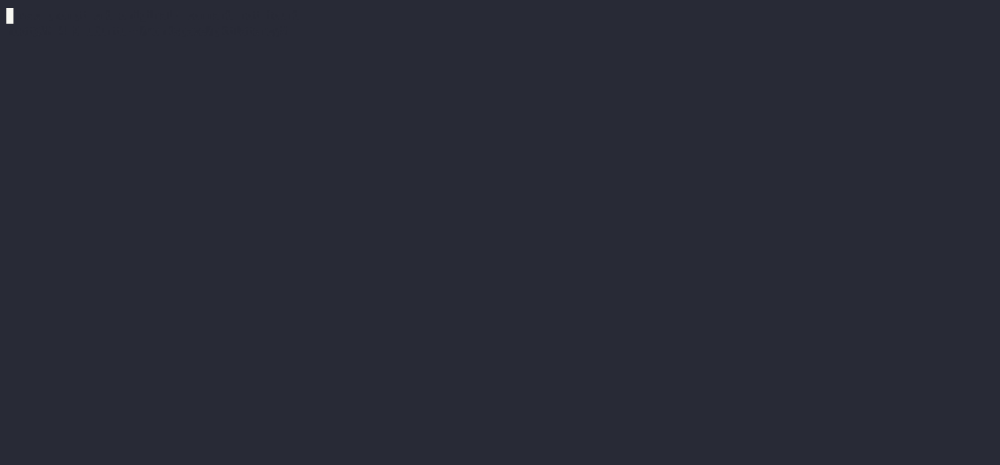
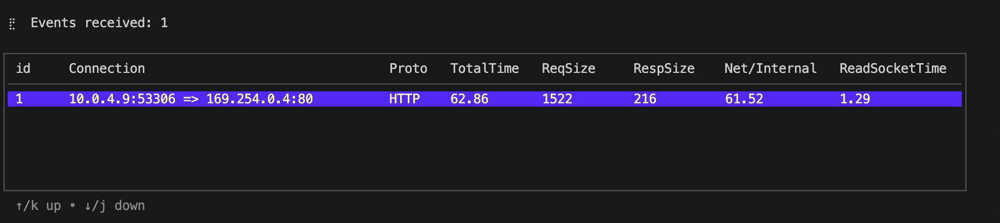
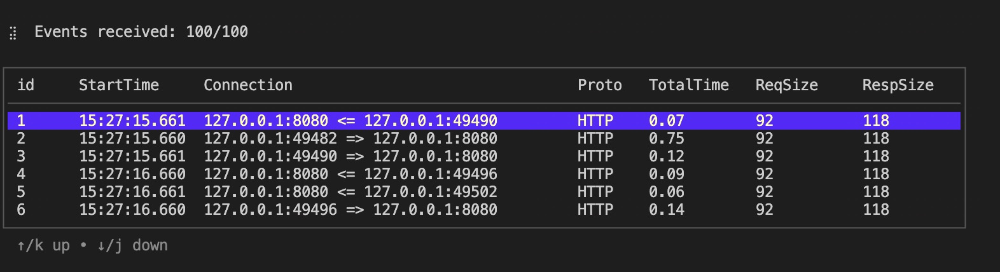
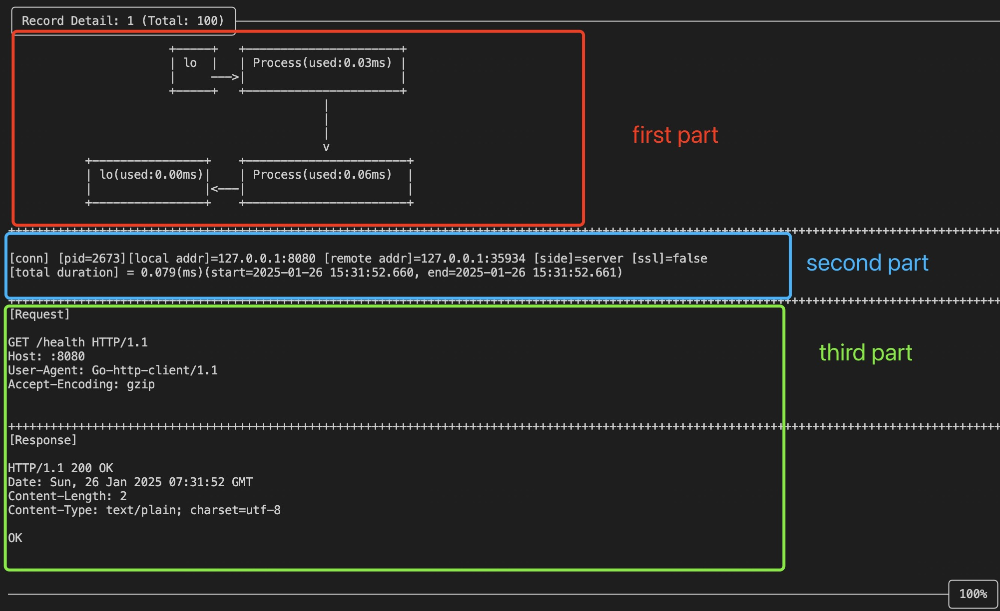

# kyanos


[简体中文](./README_CN.md) | English 

  [](#) [](#) [](#-license)[](https://github.com/hengyoush/kyanos/actions/workflows/test.yml)

- [English Document](https://kyanos.pages.dev/)

⭐ Think Kyanos is cool? Give it a star!

[](https://x.com/intent/tweet?text=Check%20out%20this%20project%20on%20GitHub:%20https://github.com/hengyoush/kyanos%20%23OpenIDConnect%20%23Security%20%23Authentication)
[](https://www.facebook.com/sharer/sharer.php?u=https://github.com/hengyoush/kyanos)
[](https://www.linkedin.com/sharing/share-offsite/?url=https://github.com/hengyoush/kyanos)
[](https://www.reddit.com/submit?title=Check%20out%20this%20project%20on%20GitHub:%20https://github.com/hengyoush/kyanos)
[](https://t.me/share/url?url=https://github.com/hengyoush/kyanos&text=Check%20out%20this%20project%20on%20GitHub)

## Table of Contents
- [Overview](#-overview)
- [Examples](#-examples)
- [Requirements](#-requirements)
- [How to get kyanos](#-how-to-get-kyanos)
- [Documentation](#-documentation)
- [Usage](#-usage)
- [Feedback and Contributions](#-feedback-and-contributions)
- [Contacts](#%EF%B8%8F-contacts)

## Overview
Kyanos is an **eBPF-based** network issue analysis tool that enables you to capture network requests, such as HTTP, Redis, and MySQL requests.   
It also helps you analyze abnormal network issues and quickly troubleshooting without the complex steps of packet capturing, downloading, and analysis.

1. **Powerful Traffic Filtering**: Not only can filter based on traditional IP/port information, can also filter by process/container, L7 protocol information, request/response byte size, latency, and more.

```bash
# Filter by pid
./kyanos watch --pids 1234
# Filter by container id
./kyanos watch --container-id abc
# Filter by Redis key
./kyanos watch redis --keys my-key1,my-key2
# Filter by response byte size
./kyanos watch --resp-size 10000
```

2. **Advanced Analysis Capabilities** : Unlike tcpdump, which only provides fine-grained packet capture, Kyanos supports aggregating captured packet metrics across various dimensions, quickly providing the critical data most useful for troubleshooting.  
Imagine if the bandwidth of your HTTP service is suddenly maxed out—how would you quickly analyze `which IPs` and `which  requests` are causing it?  
With Kyanos, you just need one command: `kyanos stat http --bigresp` to find the largest response byte sizes sent to remote IPs and view specific data on request and response metrics.  


3. **In-Depth Kernel-Level Latency Details**: In real-world, slow queries to remote services like Redis can be challenging to diagnose precisely. Kyanos provides kernel trace points from the arrival of requests/responses at the network card to the kernel socket buffer, displaying these details in a visual format. This allows you to identify exactly which stage is causing delays.

 

4. **Lightweight and Dependency-Free**: Almost zero dependencies—just a single binary file and one command, with all results displayed in the command line.

5. **Automatic SSL Traffic Decryption** : All captured requests and responses are presented in plaintext.

## Examples

**Capture HTTP Traffic with Latency Details**  

Run the command:
```bash
./kyanos watch http
```
The result is as follows:


**Capture Redis Traffic with Latency Details**  

Run the command:
```bash
./kyanos watch redis
```
The result is as follows:


**Identify the Slowest Requests in the Last 5 Seconds**

Run the command:
```bash
 ./kyanos stat --slow --time 5 
```
The result is as follows:



## ❗ Requirements

Kyanos currently supports kernel versions 3.10(from 3.10.0-957) and 4.14 or above (with plans to support versions between 4.7 and 4.14 in the future).  
> You can check your kernel version using `uname -r`.


## 🎯 How to get kyanos 

You can download a statically linked binary compatible with x86_64 and arm64 architectures from the [release page](https://github.com/hengyoush/kyanos/releases):

```bash
tar xvf kyanos_vx.x.x_linux_x86.tar.gz
```

Then, run:
```bash
kyanos watch 
```

If the following table appears:

🎉 Congratulations! Kyanos has started successfully.

## 📝 Documentation

[English Document](https://kyanos.pages.dev/)

## ⚙ Usage

The simplest usage captures all protocols currently supported by Kyanos:

```bash
./kyanos watch
```

Each request-response record is stored as a row in a table, with each column capturing basic information about that request. You can use the arrow keys or `j/k` to move up and down through the records:
  

Press `Enter` to access the details view:

  

In the details view, the first section shows **Latency Details**. Each block represents a "node" that the data packet passes through, such as the process, network card, and socket buffer.  
Each block includes a time value indicating the time elapsed from the previous node to this node, showing the process flow from the process sending the request to the network card, to the response being copied to the socket buffer, and finally read by the process, with each step’s duration displayed.

The second section provides **Detailed Request and Response Content**, split into Request and Response parts, and truncates content over 1024 bytes.

For targeted traffic capture, such as HTTP traffic:

```bash
./kyanos watch http
```

You can narrow it further to capture traffic for a specific HTTP path:

```bash
./kyanos watch http --path /abc 
```

Learn more: [Kyanos Docs](https://kyanos.pages.dev/)


## 🤝 Feedback and Contributions
> [!IMPORTANT]
> If you encounter any issues or bugs while using the tool, please feel free to ask questions in the issue tracker.

## 🗨️ Contacts
For more detailed inquiries, you can use the following contact methods:
- **My Email:** [hengyoush1@163.com](mailto:hengyoush1@163.com)
- **My Blog:** [http://blog.deadlock.cloud](http://blog.deadlock.cloud/)

[Back to top](#top)
