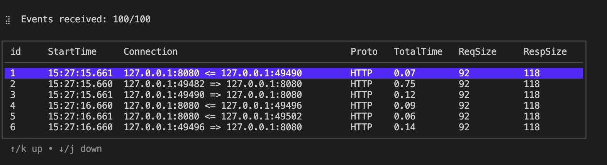

# kyanos

[](#) [](#) [](https://github.com/hengyoush/kyanos/actions/workflows/test.yml)


简体中文 | [English](./README.md)


## Table of Contents
- [What is Kyanos](#-what-is-kyanos)
- [Examples](#-examples)
- [Requirements](#-requirements)
- [How to get kyanos](#-how-to-get-kyanos)
- [Documentation](#-documentation)
- [Usage](#-usage)
- [How to build](#-how-to-build)
- [Feedback and Contributions](#-feedback-and-contributions)
- [Special Thanks](#-special-thanks)
- [Contacts](#%EF%B8%8F-contacts)

## 🦜 What is kyanos
Kyanos 是一个网络流量采集和分析工具，它提供如下特性：
1. **强大的流量过滤功能**：不仅可以根据传统 IP/端口 等信息过滤，还支持根据：进程/容器、L7协议信息、请求/响应字节数、耗时等过滤你想要的数据。
```bash
# 根据 pid 过滤
./kyanos watch --pids 1234
# 根据容器 id 过滤
./kyanos watch --container-id abc
# 根据 redis 的 key 过滤
./kyanos watch redis --keys my-key1,my-key2
# 根据响应字节数过滤
./kyanos watch --resp-size 10000
```
2. **强大的分析功能**： 和 tcpdump 只提供细粒度的抓包功能不同，kyanos 还支持以各种维度聚合抓取的数据包的指标信息，快速得到对排查问题最有用的关键数据。想象一下你的 HTTP 服务的带宽突然被打满，你该如何快速的分析是 `哪些 ip` 的 `哪些请求` 造成的？  
使用 kyanos 只需要一行命令：`kyanos stat http --bigresp` 即可找到发送给哪些远程 ip 的响应字节数最大，并且还能够发现请求响应的具体数据。

3. **深入内核的耗时细节**：在实际业务场景中我们经常遇到远程服务慢查询问题，比如访问 Redis 请求较慢，但是 **具体慢在哪里** 在传统监控方式下很难给出确切答案。而 kyanos 提供了 请求/响应 到达网卡以及从 内核Socket 缓冲区读取的内核埋点，并且以可视化的图形展示出来，你可以方便的判断是哪一个环节出现了问题。
   
如上所示，这是一个在容器内执行 `curl http://www.baidu.com` 命令的耗时记录，你可以发现 kyanos 记录了请求经过容器网卡、宿主机网卡，响应经过宿主机网卡、容器网卡、Socket缓冲区每个步骤的耗时。
4. **轻量级零依赖**：几乎 0 依赖，只需要单个二进制文件，一行命令，所有结果都展示在命令行中。
5. **SSL流量自动解密**：kyanos 为你抓取的请求响应结果全部都是明文。

## 🌰 Examples

**抓取 HTTP 流量并且获取耗时细节**  

执行命令：
```bash
./kyanos watch http
```
演示结果如下：


**抓取 Redis 流量获取耗时细节**  

执行命令：
```bash
./kyanos watch redis
```
演示结果如下：


**找到5s内最慢的几个请求**

执行命令：
```bash
 ./kyanos stat --slow --time 5 
```
演示结果如下：


## ❗ Requirements

Kyanos当前支持3.10(3.10.0-957以上)及4.14以上版本内核(4.7版本到4.14版本之间的后续计划支持)。
> 通过`uname -r`查看内核版本

## 📝 Documentation

[Chinese Document](https://kyanos.io/cn/)

## 🎯 How to get kyanos 
你可以从 [release page](https://github.com/hengyoush/kyanos/releases) 中下载以静态链接方式编译的适用于 amd64 和 arm64 架构的二进制文件：

```bash
tar xvf kyanos_vx.x.x_linux_amd64.tar.gz
```

然后以 **root 权限**执行如下命令：
```bash
sudo ./kyanos watch 
```

 如果显示了下面的表格：

🎉 恭喜你，kyanos启动成功了。


## ⚙ Usage

最简单的用法如下，抓取所有 kyanos 当前能够识别的协议

```bash
sudo ./kyanos watch
```
每个请求响应记录会记录在表格中的一行，每列记录这个请求的基本信息。你可以通过方向键或者j/k上下移动来选择记录：
  

按下`enter`进入详情界面：

  

详情界面里第一部分是 **耗时详情**，每一个方块代表数据包经过的节点，比如这里有进程、网卡、Socket缓冲区等。  
每个方块下面有一个耗时，这里的耗时指从上个节点到这个节点经过的时间。
可以清楚的看到请求从进程发送到网卡，响应再从网卡复制到Socket缓冲区并且被进程读取的流程和每一个步骤的耗时。

第二部分是 **请求响应的具体内容**，分为 Request 和 Response 两部分，超过 1024 字节会截断展示。


抓取流量时一般会更有针对性，比如抓取HTTP流量：

```bash
./kyanos watch http
```
更进一步，你可能只想抓取某个HTTP Path的流量：

```bash
./kyanos watch http --path /abc 
```

了解更多，请参考文档：[Kyanos Docs](kyanos.io)

## 🏠 How to Build

👉 [COMPILATION_CN.md](./COMPILATION_CN.md)

## Roadmap
Kyanos 的 Roadmap展示了 Kyanos 未来的计划，如果你有功能需求，或者想提高某个特性的优先级，请在 GitHub 上提交 issue。

_1.5.0_   
1. 支持 openssl 3.4.0
2. 支持解析 ipip 包
3. 支持根据 process name 过滤数据
4. 支持 postgresql 协议解析
5. 支持 kafka 协议解析
6. 完全支持 ipv6


## 🤝 Feedback and Contributions
> [!IMPORTANT]
> 如果你遇到了任何使用上的问题、bug都可以在issue中提问。


## 🙇‍ Special Thanks
在开发 kyanos 的过程中，部分代码借用了以下项目：
- [eCapture](https://ecapture.cc/zh/)
- [pixie](https://github.com/pixie-io/pixie)
- [ptcpdump](https://github.com/mozillazg/ptcpdump)

## 🗨️ Contacts
如果你有更详细的问题需要咨询，可以用以下联系方式：
- **我的微信：**:  hengyh1995。
- **我的邮箱：**:  [hengyoush1@163.com](mailto:hengyoush1@163.com)。
- **我的Blog：**:  [http://blog.deadlock.cloud](http://blog.deadlock.cloud/)。
[Back to top](#top)
